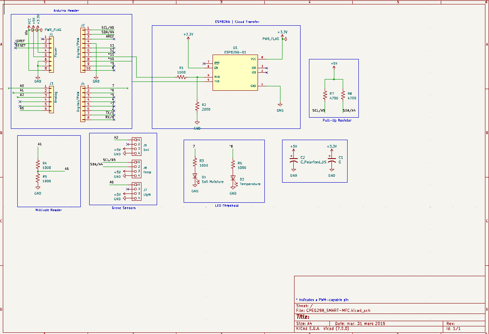
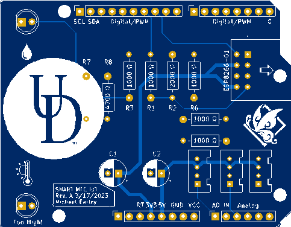
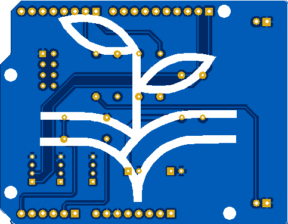
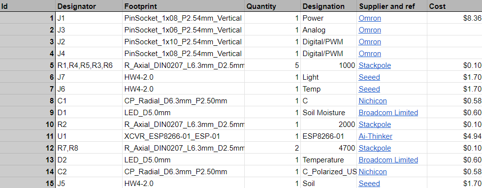
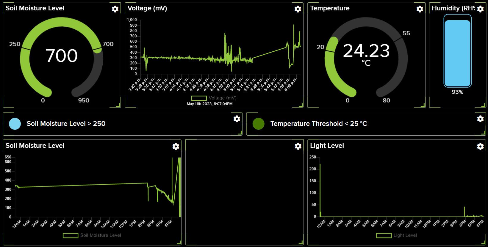

# Internet of Things Device for a Microbial Fuel Cell: IoT MFC
The purpose of this device is to measure the voltage and the surrounding environment of the said cell for research purposes.

## Schematic of SMART MFC (KiCAD)

## SMART MFC CAM
### Front 									

### Back

## SMART MFC BOM

## Arduino code
The entire Arduino sketch is divided into 3 main functions: setup(), loop(), and espData(). 

##### Note: There is also a very minor calculateVoltage() function. However, this is rather self-explanatory. 

The setup() function begins by setting up the serial monitor and the ESP8266 to a baud rate of 9600. Using the ESP8266, it connects to the internet to access Adafruit IO using both usernames and passwords given by the user. After the ESP8266 has successfully connected to Adafruit, analog pins for the light sensor, soil moisture sensor, and voltage reader are set. In addition, the DHT20 is set up using the freely accessible library by Rob Tillaart.

Within the loop() function, the entire block of code repeats every ~5 seconds. This delay is due to the fact that Adafruit only allows a maximum of 30 uploads/minute for free. Using the analogRead() function from the Arduino library, the Arduino Uno collects data in relation to the light, soil moisture, and voltage levels. In addition, the DHT20 library is used to get the humidity and temperature values from the DHT20 sensor. After each reading, the data is transmitted through the ESP8266 to Adafruit where it can be graphically displayed. This loop() function also sets threshold values for the soil moisture level and the temperature values.

Within the espData() function, the given command and data are sent to the ESP8266 using Serial UART. After the data has been sent, the function waits for a response from the ESP8266. This leads to the function printing out the response within the Serial Monitor where it can be viewed for debugging purposes.

## Libraries and Additional Sources
 • Arduino.h
 
 • Wire.h

 • SoftwareSerial.h | Allows usage of two GPIO pins for a second UART

 • DHT20.h | Allows for easier usage of the DHT20
   ESP8266 Example program provided by Theo Fleck and Rick Martin
   DHT20 Demo code provided by library author Rob Tillaart

## Adafruit Dashboard

### Line Graphs

 • Light Level | Displays the level of light over a given time interval time

 • Soil Moisture Level | Displays the level of moisture in the soil over a given time interval time

 • Voltage | Displays the voltage in millivolts of the MFC in a given time interval time   
### Circle Graphs

 • Soil Moisture Level | Displays the current level of moisture within the soil with thresholds between 250 - 700

 • Temperature | Displays the current temperature with a threshold between 20 - 55℃
### Indicators

 • Soil Moisture Level | Indicates when the current soil moisture level is over 250

•  Temperature Level | Indicates when the current temperature is below 25℃

•  Humidity Bar Graph | Displays current relative humidity

•  Feed | Displays data messages between Adafruit and the ESP8266

## Future Changes
In terms of redesign, the voltmeter on the reader still requires tweaking and is the only leading cause of concern. Its purpose in this project is to measure the produced voltage from a Microbial Fuel Cell, which in itself is like a battery having both a positive and negative node. The rise of concern comes from trying to read the amount of voltage produced by the said battery. The Microbial Fuel Cells, or MFC, that are being used in this report can range from 1 mV to 100 mV or more. 

At first, I attempted to read the voltage directly using analogRead(). However, the voltage could not be read due to the voltage being too small. After further research, I came to the conclusion of two possible solutions. 

Solution #1 is an op-amp with a high gain. However, with a capped supply voltage of 5V and a high range of 1-100+ mV, deciding an appropriate gain may be tricky. This would also require additional wiring and spacing for the PCB layout. 

While Solution #1 has a more hardware approach, Solution #2 approaches the problem through the software and proved to be more successful to an extent. Solution #2 is what is seen in the current design: the calculateVoltage() function. This function changes the reference voltage from the default 5V to 1,1V. This allows me to measure the number of millivolts directly from the MFC. While experimenting with a standalone program and an empty Arduino board, this solution works fine. However, in practice, there are further complications. After connecting the MFC’s positive voltage to its corresponding analog pin and its negative terminal to GND, the introduction of this power source causes interference within the other sensors: most notably, the soil moisture sensor. Both the soil moisture sensor and voltmeter begin producing the wrong results at an extreme degree. My assumption is that the amount of noise generated in GND by the other components on the board is too much for the millivolts reader. To improve this design, I would first need to learn how to reduce/diminish the cause of this disruption.
 

